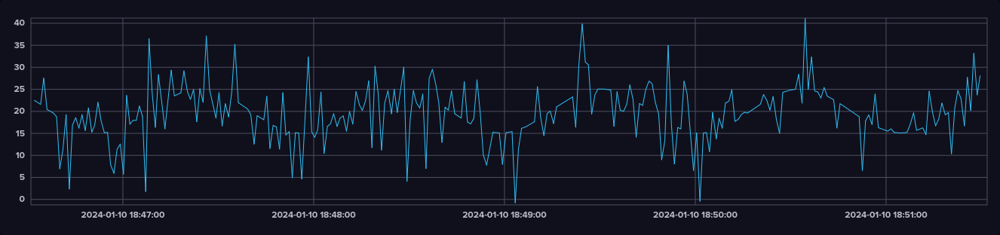
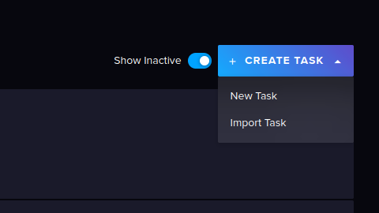
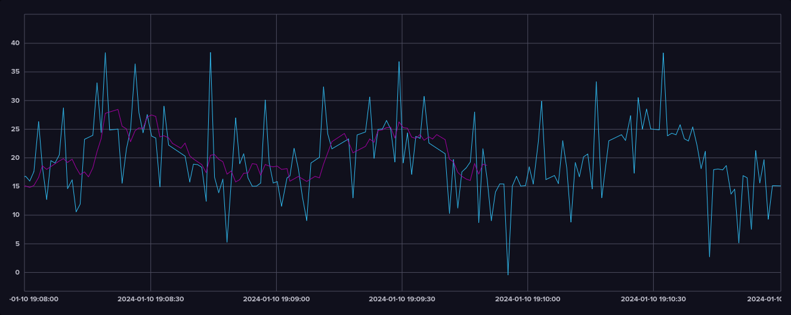
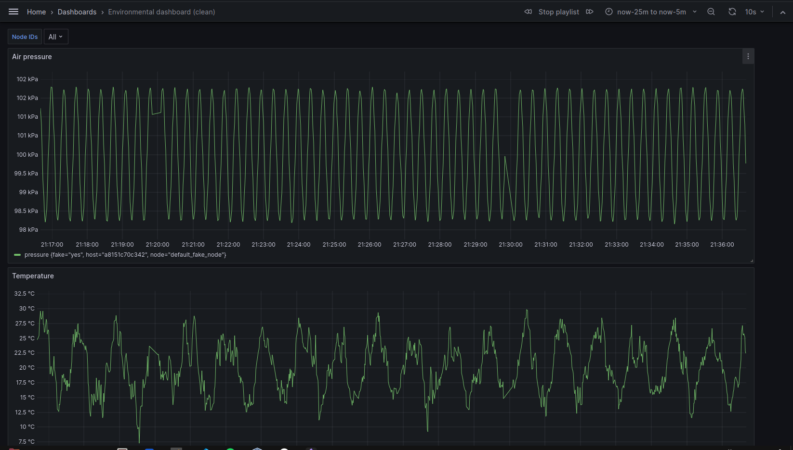
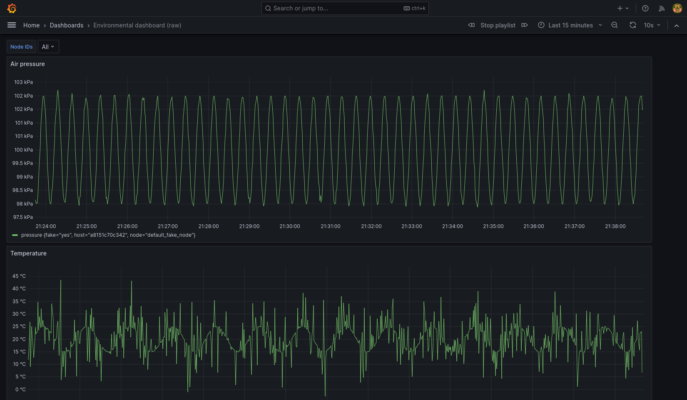

# Mini-project 2
This file contains description of what is done for mini-project 2.

Option 3, i.e. data engineering pipeline is implemented.

## Introducing noise into the measurements
The noise generation logic was copied from [here](https://gist.github.com/cao-jacky/9dec7e0883d135291917e41c80a7553f) to [noise.c](./my-iot-app/noise.c) with [a header](./my-iot-app/inc/noise.h) and called in [temperature_and_pressure.c](./my-iot-app/temperature_and_pressure.c#L43-L54)

The noise is generated with a standard deviation of 99.2 Pa for air pressure data, and 7.892°C for temperature data.

### Fake data generator script update
[The fake data generation script](./fake-node/fake_node.py) also supports periodically adding Gaussian noise into the data.

Below is a screenshot of the generated data with noise added:


## Creating a data engineering pipeline
The chosen approach is to continue receiving and storing the raw data as is.
This avoids destroying information, so the real data can be inspected if desired.

Another data bucket is created for storing cleaned up data.

InfluxDB tasks are used for processing the raw data in 10 minute batches. 
The tasks calculate a moving average based on a small number of samples.
The tasks also calculate the mean and standard deviation for 10 second time windows, 
and use that data to calculate upper and lower bounds for a ± 2 s.d. window.
> Note: adjust the time window lengths if data is produced less frequently than at 1 Hz. The fake-node script was run at 1 Hz when creating the InfluxDB tasks and Grafana dashboards.

The implemented tasks can be found [here](./server/influxdb/tasks/).

The temperature processing task runs the following query:
```flux
import "join"

// settings for the task itself
option task = {name: "copy-cleaned-iot-temp-data", every: 10m, offset: 0m}

// get the previous 10m of data
data =
    from(bucket: "iot")
        |> range(start: -10m, stop: now())
        |> filter(fn: (r) => r["_measurement"] == "measurement")
        |> filter(fn: (r) => r["_field"] == "temperature")
        |> yield(name: "raw")

// calculate mean for 10s windows
mean =
    data
        |> aggregateWindow(every: 10s, fn: mean)

// calculate standard deviation for 10s windows
stddev =
    data
        |> aggregateWindow(every: 10s, fn: stddev)

// calculate upper and lower bounds for 2 s.d. from the mean
// this is stored in the "iot-clean" bucket
limits =
    join.time(left: mean, right: stddev, as: (l, r) => ({l with _stddev: r._value}))
        |> map(
            fn: (r) =>
                ({r with _measurement: "limits",
                    _lower: r._value - 2.0 * r._stddev,
                    _upper: r._value + 2.0 * r._stddev,
                }),
        )
        |> to(bucket: "iot-clean")

// calculate moving average with n=6 and store in "iot-clean" bucket
data
    |> movingAverage(n: 6)
    |> yield(name: "movingAverage")
    |> map(fn: (r) => ({r with _measurement: "movingAverage"}))
    |> to(bucket: "iot-clean")
```

The tasks for processing air pressure data is identical except for querying for the pressure measurements.

To implement them on your own InfluxDB instance, you can import the JSON files by navigating to "Tasks" tab and selecting "Import Task" after pressing the "Create task" button:
.

After clean up, temperature data looks like this:

> The purple line is the cleaned data, blue is the raw data.

Clearly a significant portion of the noise is mitigated.

## Grafana dashboard
A new Grafana dashboard is created for viewing the cleaned up data:


when compared with the raw dashboard, we can see that the temperature data has a much narrower range. The air pressure data looks essentially the same as the raw data, as the magnitude of the noise is small compared to the data.


We can also see some data processing artifact were introduced by the batch processing.

The JSON model of the dashboard is found [here](./server/grafana/dashboard-clean.json).