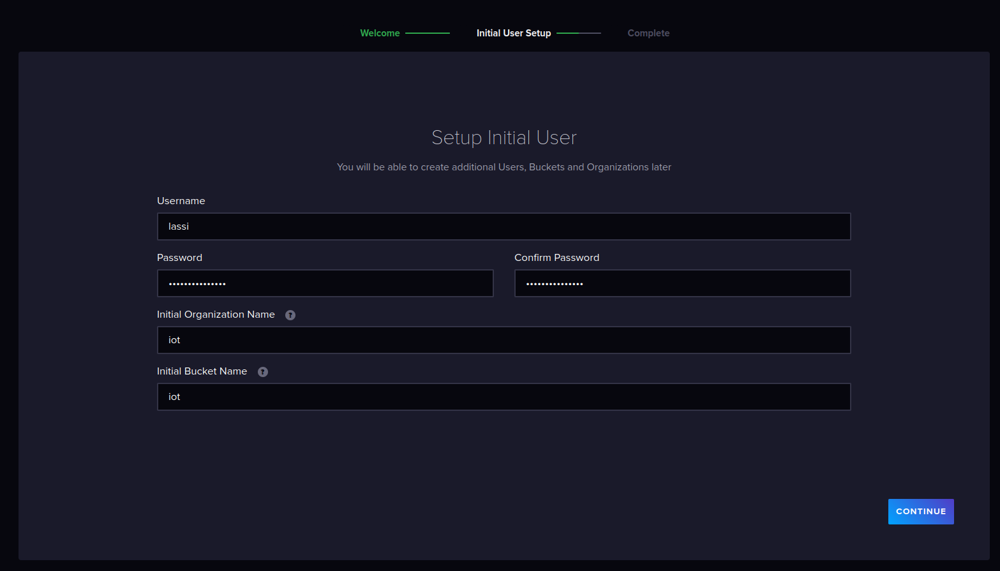
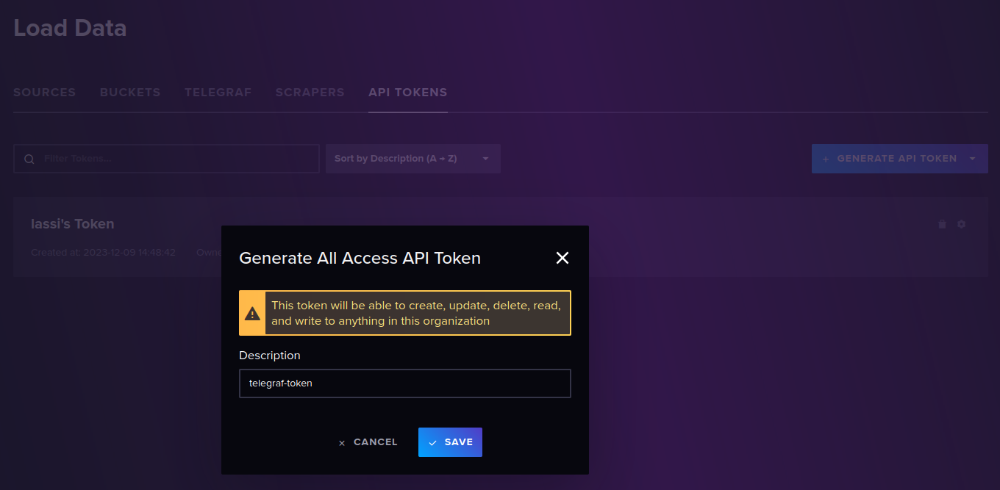
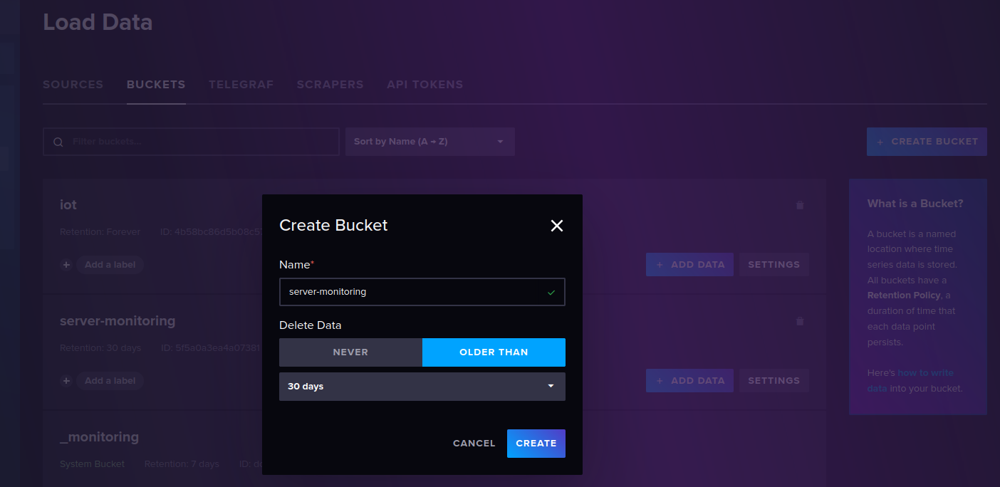
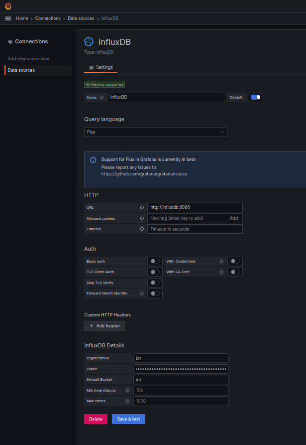
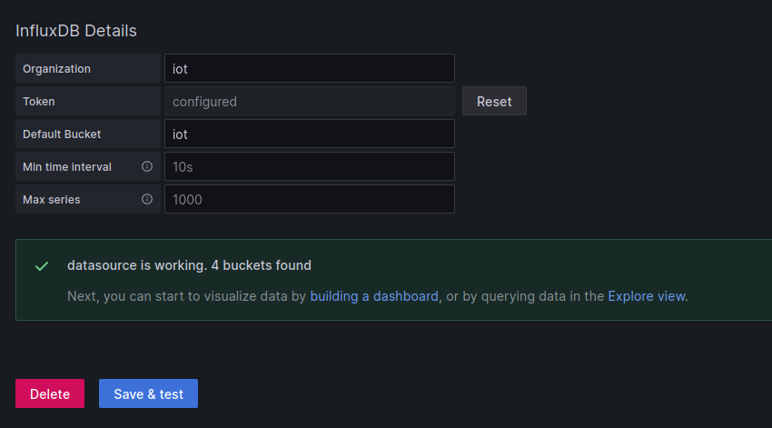

# IoT course project for University of Oulu course 521043S
> Note: this README.md describes part 1 of the project.
> See [README-part-2.md](https://github.com/LassiHeikkila/iot-project/blob/main/README-part2.md) for part 2.

This project has the following components:
- IoT node firmware running on FIT IoT-LAB nodes
    - Data collection firmware
        - custom application in [my-iot-app](./my-iot-app)
    - IPv6 border gateway firmware
        - example firmware from RIOT-OS
- Server side [TIG stack](https://www.influxdata.com/blog/tig-stack-iiot-ot/):
    - Telegraf data collection agent
        - listens on UDP port 50123
    - InfluxDB server
        - uses TCP port 8086
    - Grafana
        - uses TCP port 3000
    
FIT IoT-LAB is a large scale testbed for IoT related research. See more at: [https://www.iot-lab.info/](https://www.iot-lab.info/).

Additionally, you need an IPv6 proxy if your main server does not have IPv6 connectivity. See [ipv6-proxy](./ipv6-proxy/README.md) for details.

Instructions here assume you have SSH access to your own server.

# Demo video
[iot-project-demo-fake.webm](https://github.com/LassiHeikkila/iot-project/assets/10546142/fd932b3e-ca68-48e6-b392-5cafb003851e)

> Note: unfortunately due to issues with the FIT IoT-LAB platform, I have been unable to record a video of the whole system working.
> The above video uses a fake data generation script available [here](./fake-node/fake_node.py).

# Implementation details and setup instructions

## IoT node firmware details

RIOT-OS firmware for the FIT IoT-LAB nodes is easiest to build using the Docker image, which can be enables in the `make` process using `BUILD_IN_DOCKER=1` environment variable.

This project uses `iotlab-m3` boards, so also the `BOARD` variable must be set accordingly.

After running `fetch-dependencies.sh` to download RIOT-OS repository, run the following command to build the firmware:
```console
make -C my-iot-app BOARD=iotlab-m3 BUILD_IN_DOCKER=1 DEFAULT_CHANNEL=12
```

You will find the built firmware with path `my-iot-app/bin/iotlab-m3/my-iot-app.elf`.

## IPv6 border gateway firmware
This firmware can be built in RIOT-OS repository, by building the `examples/gnrc_border_router` firmware.

This project uses `iotlab-m3` boards, so also the `BOARD` variable must be set accordingly.

We also need to set baudrate to 500000 using the `ETHOS_BAUDRATE` variable.

After running `fetch-dependencies.sh` to download RIOT-OS repository, run the following command to build the firmware:
```console
make -C RIOT/examples/gnrc_border_router BOARD=iotlab-m3 BUILD_IN_DOCKER=1 ETHOS_BAUDRATE=500000 DEFAULT_CHANNEL=12
```

You will find the built firmware with path `RIOT/examples/gnrc_border_router/bin/iotlab-m3/gnrc_border_router.elf`.

IMPORTANT NOTE: it seems that the FIT IoT-LAB border router networking only works when the firmware is built on the server.
So run this step on the server. Make sure to source `/opt/riot.source` first and don't include `BUILD_IN_DOCKER` variable.

## Server component details
All the services are managed with Docker Compose. They can be installed and started by cloning this repository to your server, going into [`server`](./server/) directory, and running command:
```console
docker compose up
```

Hint: use `-d` flag for detached mode if you want the services to run in the background.

To access the services running on the server, you can either expose the ports to the internet, or use SSH tunneling.

SSH tunneling is easy to setup with [a remote VS Code workspace](https://code.visualstudio.com/docs/editor/port-forwarding) or straight from [the command line](https://www.tecmint.com/create-ssh-tunneling-port-forwarding-in-linux/).

### InfluxDB
InfluxDB is a time-series database.

InfluxDB requires a bit of manual setup after starting it up the first time.

First step is to configure the primary user:


Then create an access token for the Telegraf agent(s) and Grafana:



Optionally, if you wish to collect server usage and load data, you must create a separate bucket called `server-monitoring` for it:


### Telegraf
Telegraf is a data collection agent that supports a wide variety of data sources and formats.

In this project, two configurations are provided:

#### Telegraf IoT configuration
This agent configuration / instance listens on UDP port 50123 for data using [Influx line protocol format](https://docs.influxdata.com/influxdb/v1/write_protocols/line_protocol_reference/)

You must configure the `token` parameter under `[[outputs.influxdb_v2]]` section.

The configuration file is found [here](./server/telegraf/telegraf-iot.conf).

#### Telegraf monitor configuration
This agent configuration / instance collects server load data to assist in checking if the services are functioning properly.
export EXPERIMENT_ID=388074
Hint: default credentials are `admin:admin`.

#### Creating connection from Grafana to InfluxDB
You need to configure the InfluxDB connection via the web UI.

Connection is created here: `Home > Connections > Data sources > InfluxDB`.

Under "Query language" you need to choose "Flux" to support authentication via an API token.

In "HTTP > URL" field you should enter "http://influxdb:8086".

Under "InfluxDB Details", "Organization" should match what you configured when setting up InfluxDB. Here it is "iot".

Next add the API token in the "Token" field.

Everything else can be left default.



Click the "Save & test" button to verify a working connection.



#### Creating a dashboard
You also need to create a dashboard manually.

Below are a few helpful InfluxDB queries for creating a simple dashboard.

The used dashboard is also stored in the repository: [dashboard.json](./server/grafana/dashboard.json)

#### Query for node ids in data
```
import "influxdata/influxdb/schema"

schema.tagValues(bucket: "iot", tag: "node")
```

This can be used as a variable called `node_ids` in a dashboard to dynamically discover all the nodes in the available data.

#### Query for temperature
Note: This example query uses the `node_ids` variable.
```
from(bucket: "iot")
  |> range(start: v.timeRangeStart, stop: v.timeRangeStop)
  |> filter(fn: (r) => r["_measurement"] == "measurement")
  |> filter(fn: (r) => r["_field"] == "temperature")
  |> filter(fn: (r) => contains(value: r["node"], set: [${node_ids:doublequote}]))
  |> aggregateWindow(every: v.windowPeriod, fn: mean, createEmpty: false)
  |> yield(name: "mean")

```

#### Query for pressure
Note: This example query uses the `node_ids` variable.
```
from(bucket: "iot")
  |> range(start: v.timeRangeStart, stop: v.timeRangeStop)
  |> filter(fn: (r) => r["_measurement"] == "measurement")
  |> filter(fn: (r) => r["_field"] == "pressure")
  |> filter(fn: (r) => contains(value: r["node"], set: [${node_ids:doublequote}]))
  |> aggregateWindow(every: v.windowPeriod, fn: mean, createEmpty: false)
  |> yield(name: "mean")

```

# Running an experiment on FIT IoT-LAB
> Note: the following commands should be run on a FIT IoT-LAB server, or somewhere with the CLI tools installed.
> It is up to you to install the tools locally if you don't want to work on the server.
> You also need `jq` command available.

After building both firmware images, upload the firmwares onto a FIT IoT-LAB server in a directory called `firmwares`.

Then we can launch an experiment using script [./deploy/create-experiment.sh](./deploy/create-experiment.sh):

Note down the returned experiment id.

Wait a while for the experiment to start and then find out which nodes you have available:

```console
iotlab-experiment get -i ${EXPERIMENT_ID} -n | jq -r .items[].network_address
```

Example output:
```
m3-100.grenoble.iot-lab.info
m3-101.grenoble.iot-lab.info
```

The returned addresses identify which nodes are available for the experiment.
The first part of the address is the node type, in our case `m3`.
The second part of the address is the node id, e.g. `100`.

Next flash the border router firmware onto one of the nodes, and the application firmware onto the rest.

Using helper script [./deploy/flash-node.sh](./deploy/flash-node.sh):

Example:
```console
./deploy/flash-node.sh firmwares/gnrc_border_router.elf 100
./deploy/flash-node.sh firmwares/my-iot-app.elf 101
```

Check which IPv6 subnets are occupied, then in one shell activate the border router traffic forwarding by running:
```console
sudo ethos_uhcpd.py m3-${NODE_ID} tap0 2001:660:${MY_SUBNET}::1/64
```
> Note: the NODE_ID used above must be the one with border router firmware installed!
> You can also try a different interface than tap0.
> You should choose a subnet that is not used by anyone else on the platform (check used subnets by running `ip -6 route`).

Read the following for more details:
- https://iot-lab.github.io/learn/tutorials/riot/riot-public-ipv6-m3/
- https://www.iot-lab.info/docs/getting-started/ipv6/

